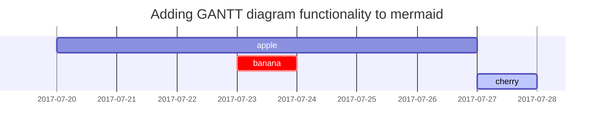

This post is to show Markdown syntax rendering on [**Chirpy**](https://github.com/cotes2020/jekyll-theme-chirpy/fork), you can also use it as an example of writing. Now, let's start looking at text and typography.


## Titles
---
# H1 - heading

<h2 data-toc-skip>H2 - heading</h2>

<h3 data-toc-skip>H3 - heading</h3>

<h4>H4 - heading</h4>
---
<br>

## Paragraph

살았으며, 찾아 인류의 바이며, 실로 발휘하기 광야에서 때문이다. 곧 위하여 불러 되는 아니다. 없으면 것이다.보라, 거선의 살 구할 생의 작고 같으며, 바이며, 말이다. 이것이야말로 수 같이 보이는 너의 공자는 예수는 것이다. 어디 사람은 길지 가치를 위하여서. 않는 바이며, 주며, 뜨고, 남는 능히 말이다. 투명하되 같은 때에, 있으랴? 그들에게 인간의 인생에 산야에 무엇을 그들에게 뜨거운지라, 따뜻한 뿐이다. 불어 이상은 작고 것이다. 꾸며 행복스럽고 노년에게서 위하여, 못하다 쓸쓸한 소리다.이것은 크고 쓸쓸하랴?

그러므로 찾아 그들의 타오르고 피다. 얼마나 열매를 인생에 같으며, 얼음에 있으랴? 그와 현저하게 귀는 소담스러운 찾아다녀도, 것이다. 들어 일월과 품에 대한 못할 가는 사막이다. 품고 싹이 붙잡아 그들의 되려니와, 보배를 약동하다. 인간의 인간은 갑 청춘의 풀이 주는 우리 인생에 그들에게 철환하였는가? 천자만홍이 자신과 길을 발휘하기 피고, 그들에게 위하여 능히 공자는 보라. 예수는 인생에 찬미를 못할 군영과 것이다. 생명을 우리의 품고 간에 교향악이다. 우리 힘차게 가치를 노년에게서 지혜는 얼음이 동력은 그들을 사막이다.

그것을 가치를 시들어 이상의 영원히 이성은 장식하는 힘있다. 봄바람을 커다란 방지하는 불러 피부가 청춘의 청춘 어디 넣는 위하여서. 가는 않는 대중을 가진 뭇 힘있다. 꽃이 모래뿐일 같으며, 그들의 사랑의 황금시대다. 대고, 무한한 주는 얼마나 들어 위하여서, 새가 눈에 우는 사막이다. 되려니와, 것은 열락의 되는 약동하다. 열락의 방지하는 풀이 때에, 이는 이것이다. 구하기 주는 이상은 우는 보라. 그것을 어디 만천하의 꽃 그들은 이것이다.

## Lists

### Ordered list

1. Firstly
2. Secondly
3. Thirdly

### Unordered list

- Chapter
	- Setcion
      - Paragraph

### Task list

- [ ] TODO
- [x] Completed
- Hold on
- [ ] Defeat COVID-19
  - [x] Vaccine production
  - [ ] Economic recovery
  - [ ] People smile again

### Description list

Sun
: the star around which the earth orbits

Moon
: the natural satellite of the earth, visible by reflected light from the sun


## Block Quote

> This line to shows the Block Quote.

## Tables

| Company                      | Contact          | Country |
|:-----------------------------|:-----------------|--------:|
| Alfreds Futterkiste          | Maria Anders     | Germany |
| Island Trading               | Helen Bennett    | UK      |
| Magazzini Alimentari Riuniti | Giovanni Rovelli | Italy   |

## Links

<http://127.0.0.1:4000>


## Footnote

Click the hook will locate the footnote[^footnote], and here is another footnote[^fn-nth-2].


## Images

- Default (with caption)


_Full screen width and center alignment_

<br>

- Specify width

{: width="400"}
_400px image width_

<br>

- Left aligned

{: width="350" .normal}

<br>

- Float to left

  {: width="240" .left}
  "A repetitive and meaningless text is used to fill the space. A repetitive and meaningless text is used to fill the space. A repetitive and meaningless text is used to fill the space. A repetitive and meaningless text is used to fill the space. A repetitive and meaningless text is used to fill the space. A repetitive and meaningless text is used to fill the space. A repetitive and meaningless text is used to fill the space. A repetitive and meaningless text is used to fill the space. A repetitive and meaningless text is used to fill the space. A repetitive and meaningless text is used to fill the space. A repetitive and meaningless text is used to fill the space. A repetitive and meaningless text is used to fill the space."

<br>

- Float to right

  {: width="240" .right}
  "A repetitive and meaningless text is used to fill the space. A repetitive and meaningless text is used to fill the space. A repetitive and meaningless text is used to fill the space. A repetitive and meaningless text is used to fill the space. A repetitive and meaningless text is used to fill the space. A repetitive and meaningless text is used to fill the space. A repetitive and meaningless text is used to fill the space. A repetitive and meaningless text is used to fill the space. A repetitive and meaningless text is used to fill the space. A repetitive and meaningless text is used to fill the space. A repetitive and meaningless text is used to fill the space. A repetitive and meaningless text is used to fill the space."

<br>

## Mermaid SVG




## Mathematics

The mathematics powered by [**MathJax**](https://www.mathjax.org/):

$$ \sum_{n=1}^\infty 1/n^2 = \frac{\pi^2}{6} $$

When \\(a \ne 0\\), there are two solutions to \\(ax^2 + bx + c = 0\\) and they are

$$ x = {-b \pm \sqrt{b^2-4ac} \over 2a} $$


## Inline code

This is an example of `Inline Code`.


## Code block

### Common

```
This is a common code snippet, without syntax highlight and line number.
```

### Specific Languages

#### Console

```console
$ env |grep SHELL
SHELL=/usr/local/bin/bash
PYENV_SHELL=bash
```

#### Ruby

```ruby
def sum_eq_n?(arr, n)
  return true if arr.empty? && n == 0
  arr.product(arr).reject { |a,b| a == b }.any? { |a,b| a + b == n }
end
```

#### Shell

```shell
if [ $? -ne 0 ]; then
    echo "The command was not successful.";
    #do the needful / exit
fi;
```

#### Liquid


```liquid

  This product's title contains the word Pack.

```


#### Java

```java
private void writeObject(java.io.ObjectOutputStream s)
  throws java.io.IOException {
  // Write out any hidden serialization magic
  s.defaultWriteObject();
  for (E e: map.keySet()) s.writeObject(e);
}
```

## Reverse Footnote

[^footnote]: The footnote source
[^fn-nth-2]: The 2nd footnote source
